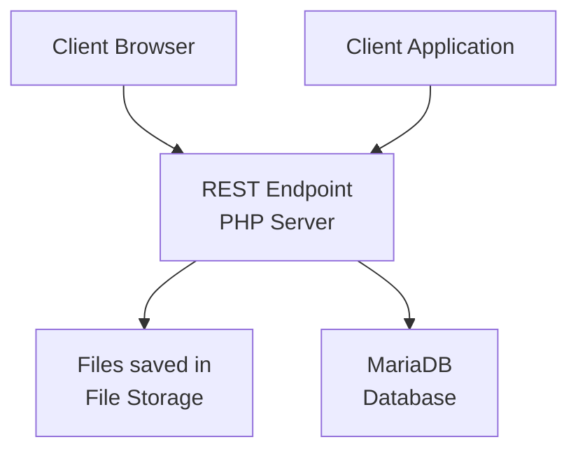

# Architecture

# Configurations
* Max file size
* Max files per sub directory
* Max number of total files

# Controller
Handles the client requests

# View
Provides GUI for users using Websnippets through a browser

# Model
Consists of Database and File Storage.
## Database
Contains the following information:
* Resources
    * Main ID
    * Read ID
    * Update ID
    * Delete ID
    * File path
    * File name
    * File type
* Request log
    * IP
    * Method
    * Timestamp
* Service protecting list
    * Blocked IPs
        * Blocking time

## File Storage

